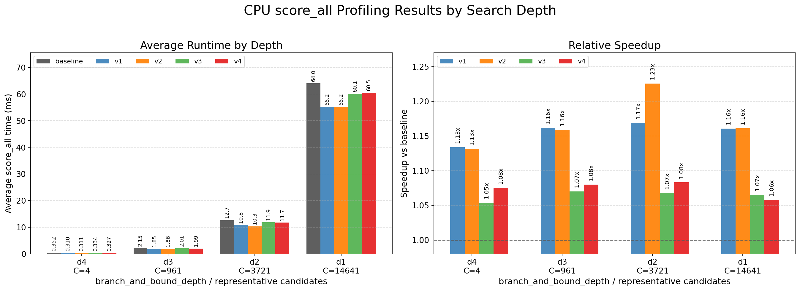
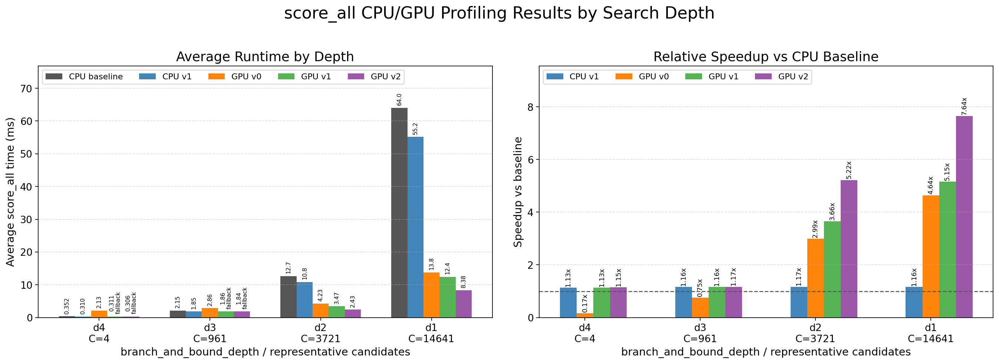

# cartographer_parallel

ROS1 package bundle for a standalone 2D fast correlative scan matcher, with
CPU and CUDA experiments for parallelizing the candidate scoring step.

The core hotspot is `score_all`: for every candidate grid offset, it sums the
occupancy values touched by the scan endpoints and normalizes the score. The
baseline implementation is intentionally simple, and the added variants explore
CPU memory/layout improvements and GPU reductions.

## Contents

- `cartographer_parallel/`: ROS1 catkin package.
- `cartographer_parallel/src/score_all.cpp`: active CPU baseline build target.
- `cartographer_parallel/src/score_all_v1.cpp` through `score_all_v4.cpp`:
  CPU optimization experiments for the same `score_all` API.
- `cartographer_parallel/src/assignment_GPU_v1.cu`: CUDA scoring experiment
  with one block per candidate and shared-memory reduction.
- `cartographer_parallel/src/assignment_GPU_v2.cu`: CUDA scoring experiment
  with warp-level reduction.
- `cartographer_parallel/maps/0501.yaml` and `0501.pgm`: included map.
- `cartographer_parallel/bags/scan.bag`: included scan bag.
- `figures/`: benchmark plots used in this report.

## Build

```bash
mkdir -p ~/catkin_ws/src
cp -r cartographer_parallel ~/catkin_ws/src/
cd ~/catkin_ws
catkin_make
source devel/setup.bash
```

By default, `CMakeLists.txt` builds the CPU library from
`cartographer_parallel/src/score_all.cpp`. To compare a CPU variant, replace
that source in `add_library(assignment_cpu_lib ...)` with one of the
`score_all_v*.cpp` files, then rebuild.

## Run With Included Bag

```bash
roslaunch cartographer_parallel cartographer_parallel_with_bag.launch ns:="student_00"
```

The launch defaults use the included map and bag:

- map: `$(find cartographer_parallel)/maps/0501.yaml`
- bag: `$(find cartographer_parallel)/bags/scan.bag`
- initial pose: `x=-2.0`, `y=6.82`, `yaw=-3.0255282583321743`

Runtime outputs:

- `/map`
- `/fast_correlative_odom`
- `/fast_correlative_candidates`
- `/fast_correlative_markers`

## Implemented Changes

- Added timing instrumentation to the scoring path so each implementation
  reports running averages and the latest call latency.
- Kept the original CPU scorer as the baseline implementation.
- Added optimized CPU variants that reduce repeated vector lookups, cache raw
  pointers, precompute normalization, use unsigned bounds checks, and reuse scan
  offsets when candidate counts are large.
- Added CUDA v1 with persistent device buffers, cached map/scan transfers, one
  CUDA block per candidate, and shared-memory reduction across scan points.
- Added CUDA v2 with the same host-side caching strategy but a warp-reduction
  kernel to reduce shared-memory synchronization overhead.
- Added a CPU fallback path in the GPU implementations for small candidate sets
  where launch and transfer overhead dominate.

## Results

The benchmark sweeps depth levels from `d4` to `d1`. Larger/deeper candidate
sets are where the optimized CPU and GPU paths show the clearest separation
from the baseline.




