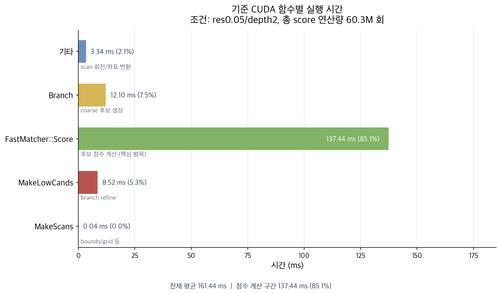
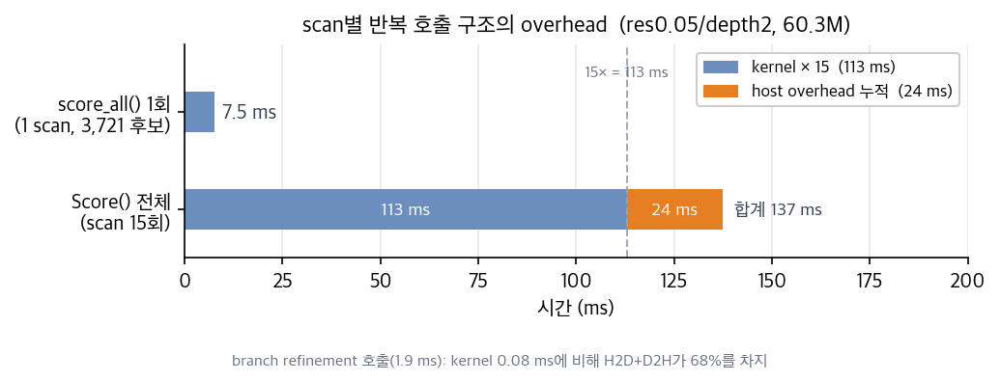
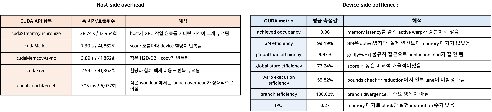
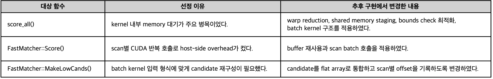
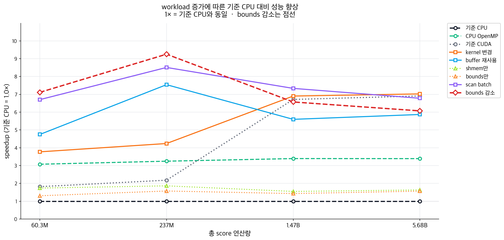
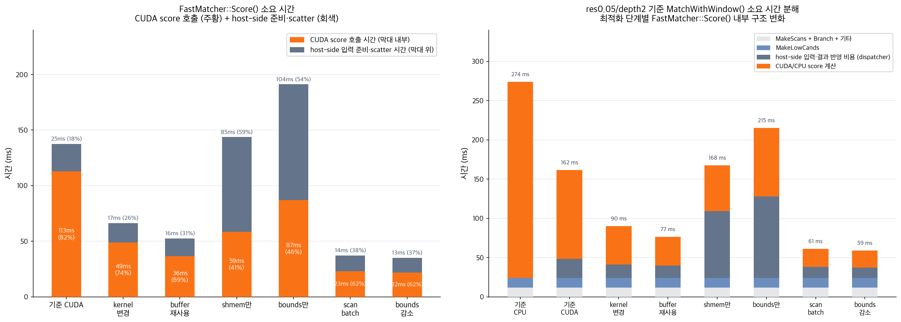
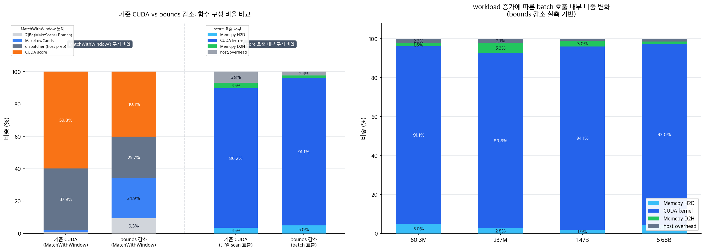

# PA02 보고서 초안: 고속 상관 스캔 매처 고속화

Cartographer Fast Correlative Scan Matcher | Jetson Nano | CUDA 10.2 | ROS Melodic

---

## 1. 실험 목적과 조건

### 1.1 PA02 실행 명령어

본 과제의 모든 결과는 Jetson Nano에서 동일한 ROS bag과 launch 설정으로 실행하였다. 분석용 `perf`, `nvprof`, log filtering 명령은 보고서 실행 절에서 제외하고, 실제 구현을 실행하는 데 필요한 명령만 정리하였다.

먼저 workspace를 빌드하고 ROS 환경을 설정한다.

```bash
cd ~/catkin_ws
catkin_make -DBUILD_CUDA_TASK=ON -DBUILD_GPU_TASK=ON -DCMAKE_BUILD_TYPE=Release
source devel/setup.bash
export ROS_MASTER_URI=http://localhost:11311
```

*기준 CUDA* 실행은 다음과 같다.

```bash
cd ~/catkin_ws
source devel/setup.bash
export ROS_MASTER_URI=http://localhost:11311
export CUDA_SCORE_VERSION=baseline

roslaunch cartographer_parallel cartographer_parallel_with_bag.launch \
  ns:=student_05 \
  branch_and_bound_depth:=2
```

최종 batch CUDA 실행은 다음과 같다.

```bash
cd ~/catkin_ws
source devel/setup.bash
export ROS_MASTER_URI=http://localhost:11311
export CUDA_SCORE_VERSION=ver8

roslaunch cartographer_parallel cartographer_parallel_with_bag.launch \
  ns:=student_05 \
  branch_and_bound_depth:=2
```

workload 증가 실험은 동일한 실행 명령에서 map resolution과 branch-and-bound depth만 변경하여 수행하였다. 본문에서는 설정 이름보다 실제 계산량인 candidate-point evaluations를 기준으로 결과를 비교한다.

### 1.2 PA02 최적화 방향

PA01에서는 `score_all.cpp`를 대상으로 CPU profiling과 GPU profiling을 수행하였다. 그 결과 CPU에서는 `grid[y * w + x]`에 대한 불규칙한 memory access가 주요 병목으로 확인되었고, 반복 연산 최소화와 OpenMP 병렬화를 적용하더라도 성능 향상은 제한적이었다. 반면 GPU 구현에서는 candidate와 scan point 계산의 독립성을 활용하여 workload가 충분히 커질 때 CPU 대비 큰 성능 향상을 얻을 수 있었다. 그러나 PA01의 GPU 최적화는 주로 `score_all()` 단일 함수와 kernel 내부 reduction 방식에 초점을 맞추었기 때문에, scan별 CUDA 반복 호출, 매 호출마다 발생하는 memory allocation/copy/free, 그리고 상위 scoring path의 host-side overhead는 여전히 남아 있었다.

따라서 PA02에서는 PA01의 결론을 출발점으로 삼아, `MakeLowCands()` → `FastMatcher::Score()` → `score_all()`로 이어지는 coarse scoring path 전체를 대상으로, scan별로 분리되던 CUDA score 호출을 여러 scan을 하나의 kernel launch로 묶는 방식, 즉 batch CUDA 구조로 재구성하였다. 이는 `score_all()` kernel 단독 최적화가 아니라, CUDA 반복 호출 overhead와 kernel 내부의 memory access 비효율을 동시에 줄이는 접근이다.

Fast Correlative Scan Matcher는 branch-and-bound 탐색의 초기 단계에서 저해상도 precomputed grid 기준으로 다수의 후보 pose(coarse candidate)를 생성하고, 각 candidate 위치에서 scan point들이 map grid와 얼마나 잘 맞는지 score를 계산한다. 이 단계에서 상위 score를 받은 소수 candidate만 이후 branch refinement에서 정밀 재평가된다. `score_all()`은 candidate 위치마다 scan point를 map grid 위에 이동시킨 뒤, 각 point가 참조하는 grid 값을 모두 더해 candidate score를 계산한다. candidate 수를 $N$, scan point 수를 $P$라고 하면 한 scan에 대한 score 계산량은 $O(NP)$이고, 여러 scan을 처리하면 전체 계산량은 scan 수에 비례하여 증가한다. 즉 candidate 수와 scan point 수가 증가할수록 scoring path는 전체 scan matching의 핵심 병목이 된다.

이번 과제에서는 Jetson Nano에서 측정한 결과만 사용하였다. 최적화 효과의 확장성을 확인하기 위해 grid resolution과 탐색 depth를 변경하여 workload를 60.3M → 237M → 1.47B → 5.68B로 단계적으로 늘려가며 분석하였다.

---

### 1.3 사용한 profiling 도구

본 실험에서는 병목을 세 수준으로 나누어 측정하였다. 함수 수준은 `std::chrono` timer로 주요 함수별 평균 실행 시간을 수집하였고, CUDA 호출 수준은 CUDA event로 H2D · kernel · D2H · host-side overhead를 분리하였다. CUDA runtime과 kernel 내부 metric은 `nvprof`로 API 호출 비용과 occupancy, global load efficiency, IPC 등을 수집하였다. 모든 측정은 ROS launch와 rosbag 실행 환경(Jetson Nano, Ubuntu 18.04 / CUDA 10.2)에서 수행하였으며, `nvprof` 누적 시간은 항목 간 상대 비율 해석에만 사용하였다.

---

## 2. *기준 CUDA*의 상세 profiling

본 보고서에서 *기준 CUDA*은 기존 CPU 기반 `score_all()`을 candidate 단위로 병렬화한 단순 CUDA 버전이다. candidate 하나를 CUDA block 하나에 대응시키고, block 내 thread들이 scan point loop를 분담하여 처리한 뒤 reduction으로 candidate score를 합산한다. 그러나 scan별로 `score_all()`을 반복 호출하며 매 호출마다 `cudaMalloc`, H2D copy, kernel launch, D2H copy, synchronization, `cudaFree`가 반복되고, `grid[y * width + x]` 접근은 candidate offset에 따라 불규칙하게 달라져 global memory access 효율이 낮다. 이후 profiling에서는 이 *기준 CUDA*를 baseline으로 삼아, 병목이 kernel 내부 계산과 CUDA 호출 구조 중 어디에서 발생하는지 분석하였다.

### 2.1 함수 수준 병목



함수별 profiling 결과, *기준 CUDA*의 실행 시간은 `FastMatcher::Score()`에 집중되어 있었다. `FastMatcher::Score()`는 `MatchWithWindow()` 전체 실행 시간의 85.1%를 차지한 반면, scan 생성, candidate 생성, branch refinement 단계의 비중은 모두 작았다. 따라서 최적화 대상은 전체 matcher가 아니라 `MakeLowCands()` → `FastMatcher::Score()` → `score_all()`로 이어지는 coarse candidate에 대한 score을 연산하는 함수들로 선정하였다. 

---

### 2.2 CUDA 호출 수준 병목

*기준 CUDA*는 coarse candidate를 scan별로 나누어 처리한다. 전체 candidate는 55,815개이지만, 실제 CUDA score 호출은 scan 15개에 대해 각각 3,721개 candidate를 처리하는 구조이다. 즉 60.3M 연산량을 한 번에 처리하지 않고 scan별 CUDA 호출 15회로 나누어 실행한다.



*기준 CUDA*는 scan별로 kernel을 반복 호출하기 때문에, kernel 시간 외에 H2D/D2H copy, synchronization, 입력 배열 구성, score scatter 비용이 매 scan마다 누적된다. coarse score_all() 15회를 합산하면 약 113 ms(= 7.5 × 15)이지만, `FastMatcher::Score()` 전체는 137 ms로 약 24 ms가 더 크다. 이 24 ms가 반복 호출마다 쌓이는 host-side overhead의 실제 크기다.

---

### 2.3 CUDA runtime 수준 상세 병목

res0.05/depth2(60.3M) 조건을 기준으로 nvprof로 측정한 CUDA runtime API 누적 시간을 분석하였다. 총 시간은 rosbag 구간 전체의 누적합이므로 항목 간 상대적 비율로 해석하였다.



`score_all()` kernel은 연산 능력 부족이 아니라 memory 응답 대기로 비어 있는 시간이 긴 것으로 확인되었다(global load efficiency 6.67%, IPC 0.27). 이는 shared memory staging과 warp-level reduction으로 kernel 내부 비효율을 줄일 수 있다는 근거가 되었다.

종합하면, 병목은 두 함수에 나뉘어 있었다. `FastMatcher::Score()`는 scan별 반복 호출 구조 자체가 문제였고, `score_all()` kernel은 내부 실행 효율이 낮았다. 두 병목은 원인이 달라 각각 별도로 개선해야 했다.

---

## 3. 최적화 대상과 선정 이유

2절에서 확인된 두 병목 축—`score_all()` kernel 내부 비효율과 `FastMatcher::Score()`의 scan별 반복 호출 overhead—은 원인이 달랐기 때문에, 각 축을 단독으로 개선한 경우와 둘을 함께 해소한 경우의 효과를 비교하기 위해 단독 개선 4가지와 통합 개선 2가지를 설계하였다. device-side 단독으로는 warp reduction(kernel 변경), shared memory tiling + warp reduction(shmem만), bounds check 최적화(bounds만) 세 가지를 각각 적용하였고, host-side 단독으로는 per-scan 호출 구조를 유지하면서 `cudaMalloc`/`cudaFree` 반복만 제거하는 buffer 재사용을 시도하였다. 통합 개선에서는 **batch kernel**을 도입하였다. 15개 scan의 point와 candidate를 하나의 flat array로 통합하여 1회 kernel launch로 전체 scan을 처리하는 구조로, scan마다 반복되던 `cudaMalloc`/copy/sync overhead를 한 번에 제거한다. batch kernel에 device-side 기법을 모두 결합한 것이 scan batch이고, 여기에 bounds check 최적화를 추가한 것이 bounds 감소이다. batch kernel로 전환하면 candidate 배열 형태도 달라지므로, `MakeLowCands()`도 수정 대상에 포함하였다.



---

## 4. 구현 상세

6가지 구현은 device-side(kernel 내부)와 host-side(호출 구조)를 각각 단독으로 또는 함께 변경하도록 설계하였다. 아래 표는 각 버전이 어떤 축을 변경하는지 요약한다.

| 버전 | warp reduction | shmem tiling | scan batch (1회 호출) | buffer 재사용 | bounds 감소 |
|---|:---:|:---:|:---:|:---:|:---:|
| *기준 CUDA* | | | | | |
| kernel 변경 | ✓ | | | | |
| buffer 재사용 | | | | ✓ | |
| shmem만 | ✓ | ✓ | | | |
| bounds만 | | | | | ✓ |
| scan batch | ✓ | ✓ | ✓ | ✓ | |
| bounds 감소 | ✓ | ✓ | ✓ | ✓ | ✓ |

*기준 CUDA*. candidate 1개 = CUDA block 1개. scan마다 개별 호출, 매 호출마다 `cudaMalloc → H2D → kernel → D2H → sync → cudaFree`.

**kernel 변경.** block-level reduction을 warp-level `__shfl_down_sync` reduction으로 교체, warp당 candidate 1개로 재구성. 호출 구조·buffer 관리는 *기준 CUDA*와 동일.

**buffer 재사용.** `FastMatcher::Score()` 진입 시 score·candidate용 device buffer를 한 번만 할당하고 이후 scan별 호출에서 재사용. grid가 바뀌지 않으면 H2D grid upload도 생략. kernel 내부는 *기준 CUDA*와 동일.

**shmem만.** kernel 내부에 ① warp-level reduction(kernel 변경과 동일), ② scan point를 256개 단위로 shared memory에 미리 올려두고 처리하는 shared memory tiling 적용. 호출 구조·buffer 관리는 *기준 CUDA*와 동일.

**bounds만.** map 경계 안에 완전히 들어오는 candidate(full_inside)는 point별 2D 좌표 변환과 범위 초과 여부 확인을 생략하고, 미리 계산해둔 1D `cell_offset[p]`로 grid를 직접 접근. 호출 구조·reduction·buffer 관리는 *기준 CUDA*와 동일.

**scan batch.** 15개 scan의 point와 candidate를 scan 경계 없이 이어붙인 단일 배열로 통합하여 CUDA 호출 15회 → 1회. kernel은 `blockIdx.y`로 scan을 구분하고 `blockIdx.x`로 candidate를 병렬 처리. kernel 내부에 warp reduction + shared memory tiling 포함. scan별 launch overhead와 sync 14회분이 제거됨.

**bounds 감소.** scan batch + bounds만의 bounds check 최적화를 결합한 최종 버전.


---

## 5. 결과와 비교 분석

2절에서 확인한 두 병목—host-side 반복 호출 overhead와 device-side kernel 내부 비효율—이 실제로 독립적으로 작용하는지, 그리고 어느 축을 개선해야 의미 있는 성능 향상이 나오는지를 세 단계로 분석하였다. 먼저 6가지 구현의 전체 실행 시간을 workload별로 비교하여 두 병목을 함께 해소했을 때와 단독으로 개선했을 때 성능 차이가 얼마나 나는지 확인하고(5.1), 이어서 `FastMatcher::Score()` 내부를 CUDA score 시간과 host dispatcher 시간으로 분해하여 kernel 효율만 높였을 때 전체 Score() 시간이 실제로 줄어드는지를 살펴보았으며(5.2), 마지막으로 반복 호출 overhead를 제거한 이후 남은 단일 batch 호출 내부를 H2D·kernel·D2H 단위까지 분해하여 지배적 병목이 무엇인지 확인하였다(5.3).

### 5.1 전체 실행 시간 비교



그림 5.1은 각 최적화 버전의 workload별 `MatchWithWindow()` 실행 시간을 기준 CPU 대비 배율(기준 CPU = 1×)로 나타낸다. CPU OpenMP SIMD(4 threads)는 비교 기준으로 추가하였다.

**작은 workload에서는 반복 호출 overhead 제거가 가장 큰 효과를 낸다.** 60.3M·237M 구간에서는 scan batch와 bounds 감소의 성능 향상이 가장 두드러졌다. 이 구간에서는 kernel 계산 시간(113 ms)보다 scan별 CUDA 반복 호출 overhead의 비중이 상대적으로 크기 때문이다. scan batch는 15개 scan을 하나의 batch kernel로 통합하여 이 overhead를 제거했고, bounds 감소는 여기에 per-point bounds check 생략까지 더해 가장 높은 성능을 냈다. 237M에서 피크를 찍는 것은 batch당 연산량이 충분히 커 GPU 활용률이 높아지면서도 memory bandwidth 병목이 아직 지배적이지 않아, batch 처리 효과가 극대화되는 구간이기 때문이다.

**큰 workload에서 GPU 구현들의 speedup이 수렴하는 것은 최적화 방식보다 연산량이 지배하기 때문이다.** CPU는 이 구간에서 비선형적으로 느려지는 반면 GPU는 비교적 일정하게 확장된다. 높은 speedup을 보이던 구현은 위에서, 낮았던 *기준 CUDA*와 kernel 변경은 아래서 함께 수렴한다. **이 구간의 speedup 변화는 최적화 효과가 아니라 workload 특성의 변화다.**

**단독 최적화는 추가 host 작업이 생기면 효과가 상쇄될 수 있다.** buffer 재사용·shmem만·bounds만은 일부 병목을 개선하였지만 per-scan 호출 구조를 유지한 채 추가 입력 준비 작업이 필요하였다. 특히 shmem만과 bounds만은 scan마다 tiling 배열 구성이나 precomputed offset 배열 생성이 반복되어 host-side 비용이 *기준 CUDA* 대비 3–4배 급증하였고, GPU에서 절약한 시간을 CPU가 소비하는 구조가 되었다. 결과적으로 일부 구간에서 CPU OpenMP보다도 낮은 성능을 보였다. 자세한 시간 분해는 5.2에서 확인할 수 있다.

**매우 큰 workload에서는 kernel 내부 memory 병목이 최종 한계를 결정한다.** 5.68B 구간에서는 대부분의 CUDA 버전이 6–7× 수준으로 수렴하였다. workload가 매우 커지면 kernel의 memory bandwidth 병목이 지배적이 되고, 호출 구조나 buffer 관리 방식의 차이는 미미해진다. 이 시점에서 성능을 결정하는 것은 kernel 내부의 memory access 효율이다.

결국 그래프 전체를 관통하는 패턴은 하나다. GPU를 더 잘 쓰는 것과 CPU에서 덜 반복하는 것, 두 가지를 함께 해결했을 때만 의미 있는 개선이 나왔다.

---

### 5.2 `FastMatcher::Score()` 내부 시간 분해



그림 5.2는 `FastMatcher::Score()` 실행 시간을 CUDA score 시간과 host dispatcher 시간으로 분해한 결과이다(res0.05/depth2, 60.3M 기준). CUDA score 시간은 H2D · kernel · D2H를 포함한 CUDA 호출 구간이며, host dispatcher는 CUDA 호출 전후의 입력 배열 구성, score scatter, candidate 정렬 등 CPU 측 처리 시간이다. scan batch와 bounds 감소(batched 버전)는 CUDA score 시간이 전체 배치를 한 번에 처리하는 구간이다.


**kernel만 최적화하면 Score() 전체 시간이 오히려 늘어난다.** shmem만과 bounds만은 CUDA score와 host dispatcher 모두에서 *기준 CUDA*보다 나쁜 결과를 낸다. 두 가지 원인이 결합된 결과다. 첫째, 두 버전이 목표한 최적화는 실제 kernel bottleneck을 건드리지 못했다. `score_all()`의 실질적 병목은 candidate offset에 따라 주소가 불규칙한 grid read인데, shmem만은 이와 무관한 scan point caching을 시도하였고, bounds만은 cheap한 비교 연산을 오히려 더 비싼 `cell_offset[p]` global memory read로 대체하였다. 둘째, per-scan 호출 구조를 유지한 채 scan마다 추가 준비 작업이 반복되어 host dispatcher가 *기준 CUDA*(24.6 ms)의 3.5×~4.2×로 급증하였다. CUDA score와 dispatcher 양쪽이 동시에 악화된 이 결과는, 병목의 위치를 잘못 진단한 kernel 최적화가 전체 성능을 개선하지 못할 뿐 아니라 host overhead까지 키울 수 있음을 보여준다.

**두 병목을 동시에 해소했을 때만 의미 있는 개선이 나온다.** bounds 감소는 batch 통합으로 CUDA score(112.9→22.0 ms)와 dispatcher(24.6→13.2 ms)를 함께 줄였다. Score() 내 CUDA score 비중이 82%에서 62%로 변하였지만 절대 시간은 양쪽 모두 감소하여 총 Score()가 137.5 ms → 35.2 ms로 단축되었다. shmem만·bounds만이 CPU OpenMP에도 못 미쳤던 것과 대조적으로 bounds 감소는 전 workload 구간에서 OpenMP의 2배 이상을 달성하였다.

**MakeLowCands는 batch 버전에서 구현이 바뀌었음에도 시간은 12.1 ms로 동일하다.** scan batch와 bounds 감소에서 MakeLowCands는 candidate를 per-scan 배열이 아니라 flat array + offset 구조로 재구성하도록 변경되었다. 그럼에도 시간이 그대로인 것은 생성하는 candidate 수 자체가 변하지 않기 때문이다. 구조 변경의 추가 비용은 사실상 없었다. Branch+기타(11.9 ms)는 Score() 상위 소수 candidate에만 작동하므로 scoring 방식이 달라져도 영향이 없다. 두 단계가 일정하다는 것은 버전 간 성능 차이가 `FastMatcher::Score()` 내부에서만 발생하였음을 확인해준다.

---

### 5.3 bounds 감소 구현의 score 호출 내부 분석



그림 5.3은 bounds 감소 구현의 단일 score 호출 내부를 H2D · kernel · D2H · host overhead로 분해한 결과이다. 좌측은 *기준 CUDA*와의 구성 비율 비교, 우측은 workload별 비중 변화를 나타낸다.

**batch 통합 이후에는 kernel이 병목의 중심이 되었다.** 기준 CUDA 단일 scan 호출에서는 H2D(3.5%)·D2H(3.5%)·host overhead(6.8%)가 합산 13.8%를 차지하였다. 반면 bounds 감소 batch 호출에서는 kernel 비중이 91.1%에 달하였다. 반복 overhead를 제거하자 kernel 연산 자체가 지배적 병목으로 남은 것이다.

**H2D·D2H는 workload에 비선형적으로 변화하였다.** H2D는 scan point 배열(고정)·candidate 입력(candidate 수 비례)·grid 데이터(해상도 제곱 비례)의 세 항목이 각각 다른 요소에 의존하므로 workload 배수와 다른 비율로 증가한다. D2H는 candidate score만 반환하므로 candidate 수에만 비례한다. 이 구조 차이로 237M·1.47B에서 candidate 증가가 지배적일 때 D2H가 H2D를 역전하였고(H2D=1.71 ms < D2H=3.25 ms, H2D=9.30 ms < D2H=14.35 ms), 5.68B에서 해상도 변경으로 grid 데이터가 H2D에 더해지면서 다시 역전되었다(H2D=89.8 ms > D2H=27.5 ms).

**kernel 시간도 workload에 비선형적으로 변화하였다.** 60.3M→237M 구간에서는 workload(3.93×)보다 느리게 증가하였다(2.82×). candidate 수가 늘어 CUDA block 수가 증가하고 latency hiding 효과가 강화된 덕분이다. 237M→1.47B 구간에서는 반대로 workload(6.2×)보다 빠르게 증가하였다(8.18×). candidate가 대량으로 늘어 같은 grid 데이터에 접근하는 block 수가 급증하면서 cache 경쟁이 심해지고 memory bandwidth 압력이 높아졌기 때문이다. 1.47B→5.68B에서는 memory bandwidth 포화가 지배적이 되어 workload(3.87×)와 거의 비례 수준(4.3×)으로 수렴하였다.

---

## 6. 결론

본 실험에서 가장 중요한 발견은 두 병목이 독립적으로 작용한다는 점이었다. kernel을 개선하면서 per-scan 호출 구조를 그대로 두면 host-side dispatcher 비용이 오히려 3~4배 급증하고, 반대로 batch 통합만으로는 kernel 내부 비효율이 남는다. shmem만·bounds만이 *기준 CUDA*보다 느린 결과가 이를 직접 증명한다. 두 축을 함께 해소했을 때만 의미 있는 개선이 나왔다.

대표 조건(60.3M)에서 기준 CPU 대비 7.11×, 237M에서 최대 9.26×를 달성하였으며, 전 workload 구간에서 CPU OpenMP SIMD(4 threads, ~3.3×)의 2배 이상을 유지하였다. batch 통합 이후 전체 시간의 91% 이상이 kernel로 구성되었고, kernel 내부의 memory access 효율이 다음 병목으로 남았다.
