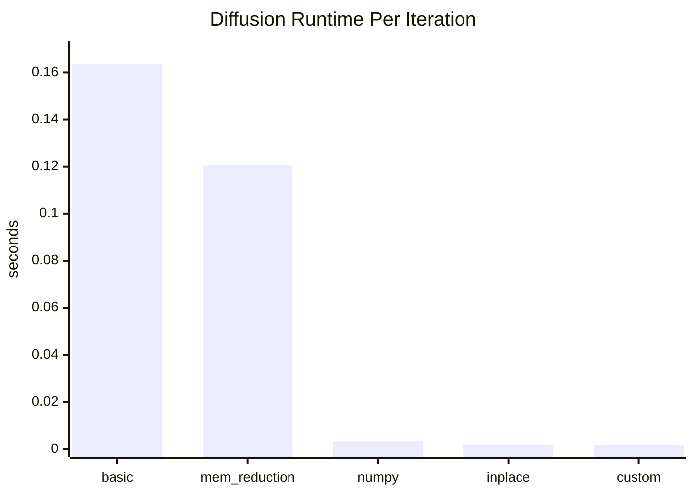

# Week 04 Diffusion Performance Comparison

## Overview

This directory compares five diffusion implementations in the following order:

1. `basic`
2. `mem_reduction`
3. `numpy`
4. `inplace`
5. `custom`

The time comparison below uses the elapsed times written in each `diffusion_*.py` file.

The memory comparison uses `minor-faults` recorded in each `diffusion_*.txt` result file. This is not a direct peak-memory metric like RSS, but it is still a useful proxy for memory activity. Because each implementation uses a different number of iterations, both comparisons include a normalized per-iteration view.

## Time Comparison

| Implementation | Script | Iterations | Total Time (s) | Time / Iteration (s) |
|---|---|---:|---:|---:|
| `basic` | `diffusion_basic.py` | 100 | 16.341470 | 0.163415 |
| `mem_reduction` | `diffusion_mem_reduction.py` | 100 | 12.065674 | 0.120657 |
| `numpy` | `diffusion_numpy.py` | 500 | 1.716116 | 0.003432 |
| `inplace` | `diffusion_inplace.py` | 1000 | 1.931408 | 0.001931 |
| `custom` | `diffusion_custom.py` | 1000 | 1.775725 | 0.001776 |

### Runtime Per Iteration

Lower is better.



## Memory Comparison

The values below come from `minor-faults` in the recorded `perf stat` output inside each result text file.

| Implementation | Result File | Iterations | Minor Faults | Minor Faults / Iteration |
|---|---|---:|---:|---:|
| `basic` | `diffusion_basic_result.txt` | 100 | 80426 | 804.26 |
| `mem_reduction` | `diffusion_mem_reduction_result.txt` | 100 | 49694 | 496.94 |
| `numpy` | `diffusion_numpy_result.txt` | 500 | 430500 | 861.00 |
| `inplace` | `diffusion_inplace_result.txt` | 1000 | 40554 | 40.55 |
| `custom` | `diffusion_custon_result.txt` | 1000 | 39171 | 39.17 |

### Memory Activity Chart

Lower is better.

```text
Minor Faults Per Iteration

basic         | ##################################### 804.26
mem_reduction | #######################               496.94
numpy         | ######################################## 861.00
inplace       | ##                                      40.55
custom        | ##                                      39.17
```

## Notes

- `basic` is the slowest version by a large margin.
- `mem_reduction` improves the pure Python version by reusing the output buffer.
- `numpy` is much faster than the list-based versions, but its memory activity is still high because `np.roll` creates temporary arrays.
- `inplace` and `custom` are the fastest implementations in normalized runtime.
- `custom` shows the lowest recorded memory activity, with `inplace` very close behind.
- The current `diffusion_inplace_result.txt` includes a valid `perf stat` measurement: `40,554` minor faults over `1000` iterations.
